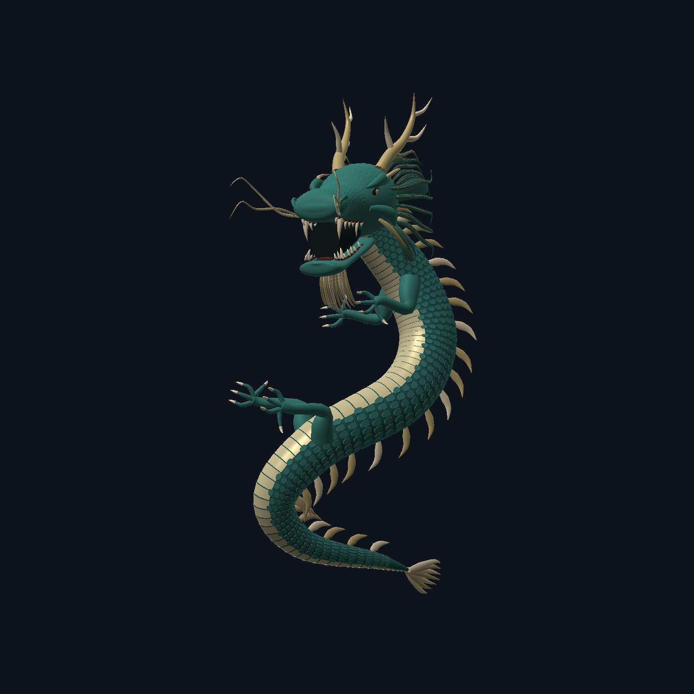
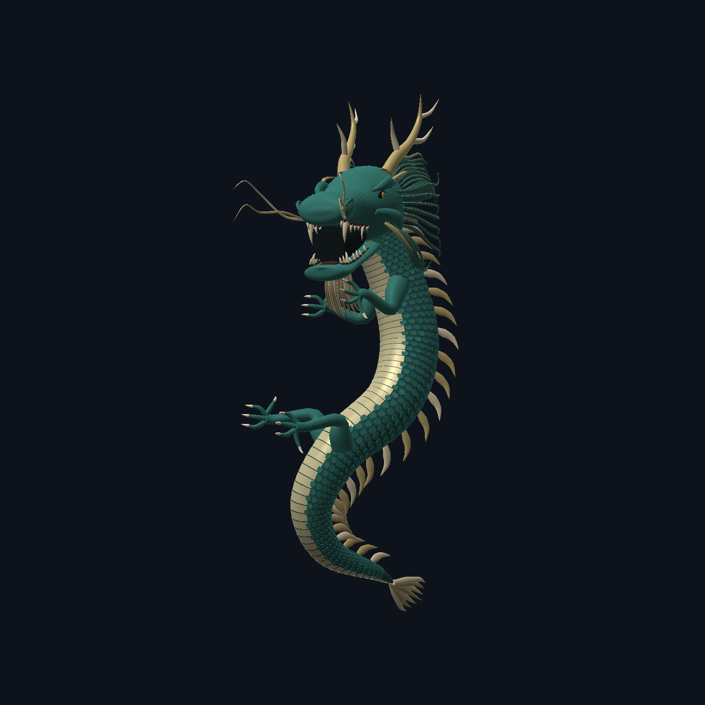
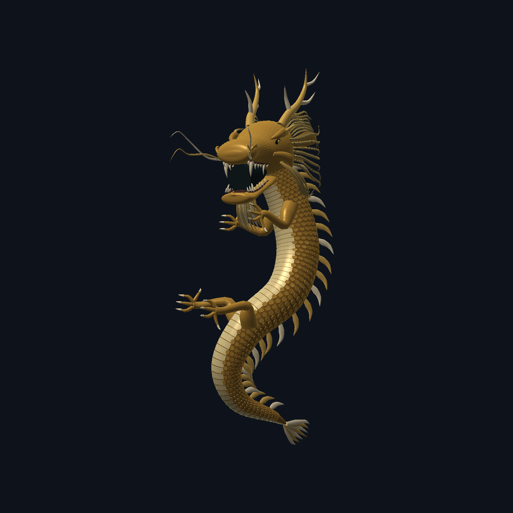
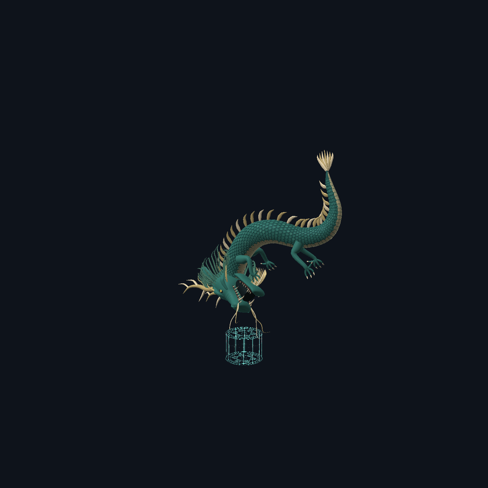

# 自制龙第三轮：三倍尺寸、舒展身体、细节精修

继续使用项目自己的程序化 3D 模型，没有购买或导入外部模型。

## 本轮修改

- 按游戏视觉尺寸理解“三倍”：实例的长、宽、高统一缩放到上一版的 3 倍，并非数学体积仅增至 3 倍。俯冲实例系数从 2.7 到 8.1；天子剑双金龙和其他龙实例同步放大。双金龙间距同比调整，保留向内朝向。
- 身体保留自然 S 形，脊柱横向控制点跨度从 1.10 缩为 0.70（约减少 36%），不是拉成僵直棍状。四肢继续从新脊柱取位置，头部与命中点保持连接。
- 身体底层由 100×28 提升至 144×36 分段；头颅/下颌纵向分段由 48/36 到 64/48。
- 鬃毛每侧三组、每组由 5 束增加到 7 束，毛束收细并保留独立细丝；鳞片增加少量青玉/金色明暗变化。
- 单条龙从 43,272 增到 49,816 个四边面（约增加 15%），双龙 99,632 面，仍低于现有 120,000 面渲染上限。继续使用缓存网格，没有因为尺寸三倍而复制三份模型。
- 伤害、定身时长、法阵大小不变。放大后仍按实际鼻尖计算第 32 tick 的落点。

## 同机位造型对比

以下是 Minecraft 开发客户端实际生产渲染器的离屏测试，不是 AI 概念图，也不是进入玩家存档的截图。单体图使用相同归一化机位比较身体造型；游戏中的三倍尺寸由实例变换实现。

| 修改前 | 修改后 |
| --- | --- |
|  |  |

## 俯冲尺寸

为避免新巨龙被画面截断，下面测试相机已后移；中央双法阵实际直径仍为 4.7 格，可以作为大小参照。不要根据前后图片中的像素高度直接判断三倍关系。

## 验证与交付

- 19 项游戏逻辑测试全部通过，正式构建成功；`gametest-results.log`。
- 16 帧实际渲染测试通过，资源重载后逐像素 RGB 最大差 0；`runtime-PASS.txt`。
- 1,147 枚体鳞、100,936 个表面采样：穿入底层皮肤 0，相邻鳞片交叉 0；2,856 个鬃毛自由端采样：埋入头颅 0。完整几何检查与 242 帧旧特效诊断通过。
- 新双阵诊断 177 个分数 tick 通过，8.1 倍实例的鼻尖落点正确。这些检查不等于所有世界场景、所有肢体动态或整合包帧率已经验证。
- 更新本地 `modpack/mods/dynasty-1.4.0.jar`，没有上传 GitHub，没有运行 HMCL 同步或修改玩家存档。
- 新 JAR SHA-256：`acdfaf36890fb055795a81b93822b43733367542ca48a9dfc10005aab915e7a0`。
- 上一版模型源码和 JAR 备份：`build/dragon-refinement-v3.SMQMpc/`；未来执行 clean 会删除该 build 备份。前版图片保留在本目录 before 和上一轮 docs 中。
