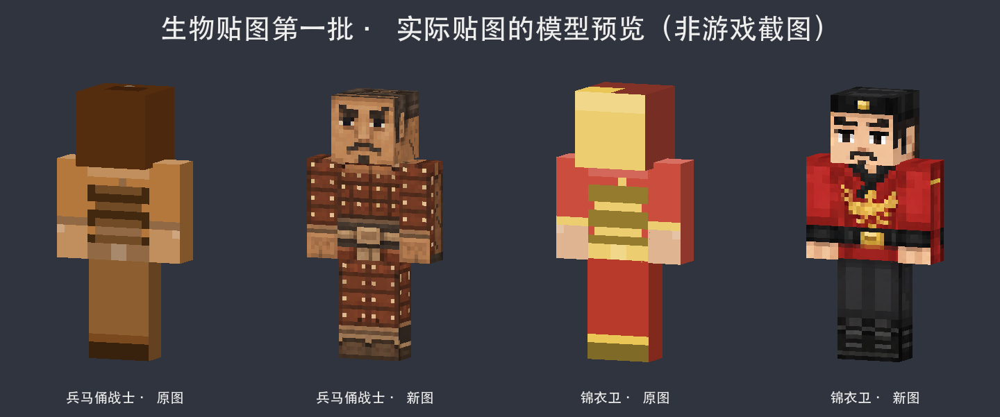

# 生物贴图第一批：兵马俑战士、锦衣卫



本轮只替换 `terracotta_warrior.png` 和 `royal_guard.png`。之前已经完成的六件物品贴图保持不变，其余生物继续分批处理。

| 生物 | 本轮设计 |
| --- | --- |
| 兵马俑战士 | 陶土眉眼与胡须、发冠雕纹、烧陶甲片、铆钉、磨损裂纹、护胫和腰带 |
| 锦衣卫 | 黑色帽冠及金色帽徽、清楚的五官、朱红交领衣袍、金色胸前纹样、黑色腰带及长靴 |

## 游戏资源

两张贴图从 64×64 提高至 128×128 RGBA，以保留五官和服饰纹样的像素细节。仍然沿用原模型 64×64 的归一化 UV，因此不会改变模型尺寸，也无需修改实体注册或渲染器。保留原文件名及路径：`src/main/resources/assets/dynasty/textures/entity/`。

原图的头部外层有大片不透明区域，能够遮住底层五官。本批将帽冠画在基础头部，外帽层透明；四个基础部件的 24 个 UV 面均保持完全不透明。左右四肢沿用真实 HumanoidModel 的镜像共享贴图，未套用玩家皮肤的独立左臂布局。

## 原稿与复现

`before/` 保存本轮开始时的原图。`sources/` 保存内置 image_gen 生成的原稿和输入布局，`prompts.json` 保存完整提示词。

`tools/art/entity_batch_01.cjs` 负责逐面采样归位和模型预览，需要 Node.js 与 sharp。它只导出这两个明确命名的生物：

```sh
node tools/art/entity_batch_01.cjs prepare src/main/resources/assets/dynasty/textures/entity
```

生成稿的锦衣卫头部有两个逻辑像素的偏移，导入时按脸、头顶及两侧逐面归位。脚底、手掌底和下巴从相应边缘采样补齐；UV 面内少量透明边缘使用该面最近的不透明像素延展。所有空白布局区保持透明，未把整幅生成图作为未经校正的皮肤直接使用。

## 验证和预览范围

预览使用 Forge 1.20.1 的 `HumanoidModel.createMesh` 尺寸、UV、左右镜像及头部外层结构，通过 CPU 对真实 PNG 进行纹理采样渲染。兵马俑使用 0.0 膨胀量，锦衣卫使用项目定义的 0.1 膨胀量。前后对比均保留各自的原贴图尺寸，使用相同视角和光照。

本轮检查了正侧面与背面、24 个基础面的不透明覆盖、帽层透明、实体资源引用、Forge 构建以及构建 JAR / 整合包 JAR 的贴图内容一致性。预览不是游戏截图，尚未进行实机动画或光照验收。
