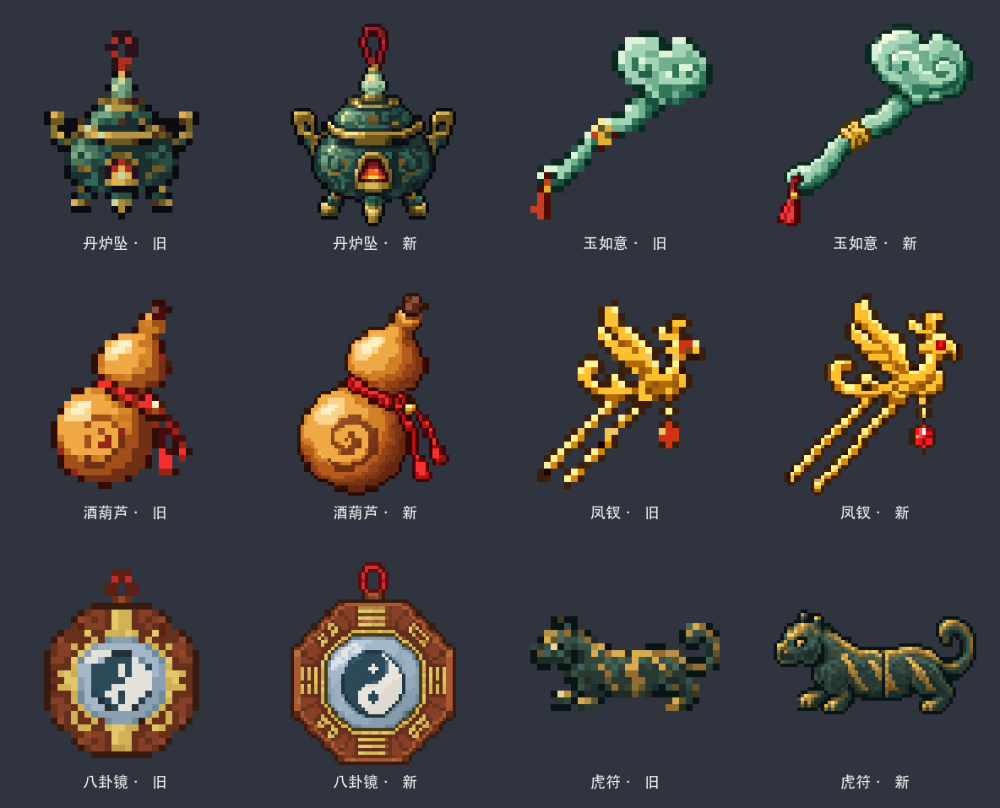

# 六件物品贴图放大版

这次从六件物品各自的原始设计稿重新导出，不改变丹炉坠、玉如意、酒葫芦、凤钗、八卦镜、虎符的形状或主题。之前的 32×32 成品保存在 `before/`。

| 参数 | 上一版 | 当前版 |
| --- | --- | --- |
| PNG 尺寸 | 32×32 | 64×64 |
| 主要轮廓尺寸 | 约 28×28 | 约 60×60 |
| 图案在贴图宽高中的占比 | 约 87.5% | 约 93.75% |
| 颜色上限 | 20 | 48 |

源图通过最近邻采样转换，保持清晰的整数像素边缘，并使用二值透明通道。六件物品占格子更大，原稿中的线条、金属高光、玉石和青铜纹样也保留了更多信息。64×64 是 2 的幂，原有 `minecraft:item/generated` 模型直接引用，无需修改模型文件。

后续物品贴图沿用此标准：围绕物体轮廓保留约两像素透明边距；把物体画得足够大，同时不能裁断挂绳、穗子、武器尖端。制作时先在实际物品栏大小检查可读性，再看放大图的细节。生物 UV 贴图另按其模型结构与所需分辨率处理。

本次更新了 `tools/art/export_readable_batch_01.sh` 和 `tools/art/export_readable_batch_02.sh`，重导出时会得到当前 64×64 尺寸。`before/` 用于恢复本次放大前的六张 32×32 成品；两个原批次的 `before/` 则保存更早的旧图。

对比图是贴图文件的近邻放大预览，不是游戏截图。已检查六张游戏 PNG、透明通道、模型引用和构建 JAR 内容；最终物品栏视觉效果仍需进游戏确认。
