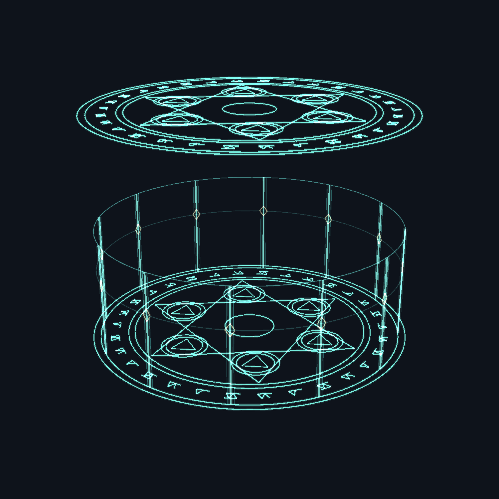
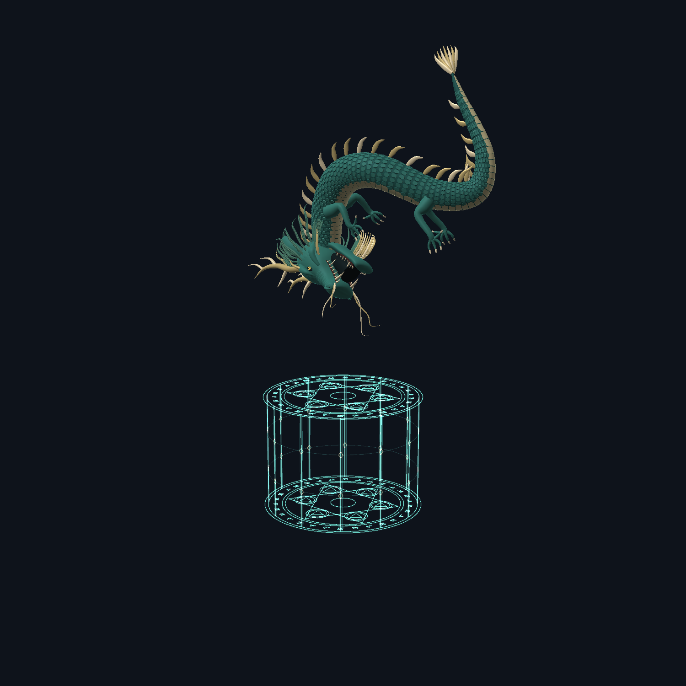
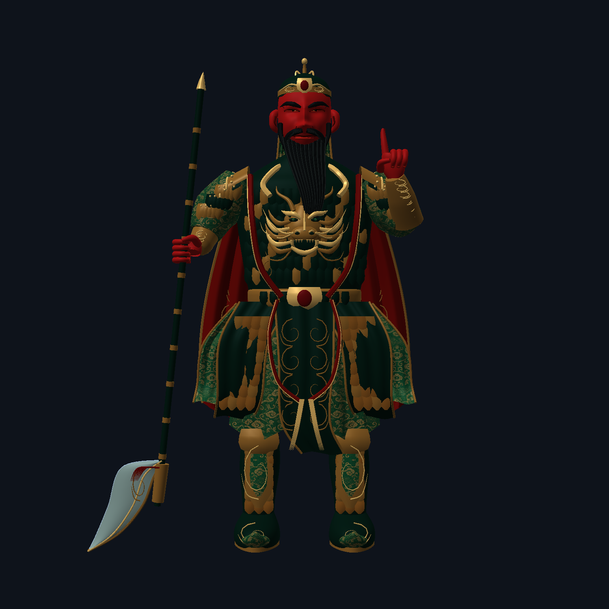
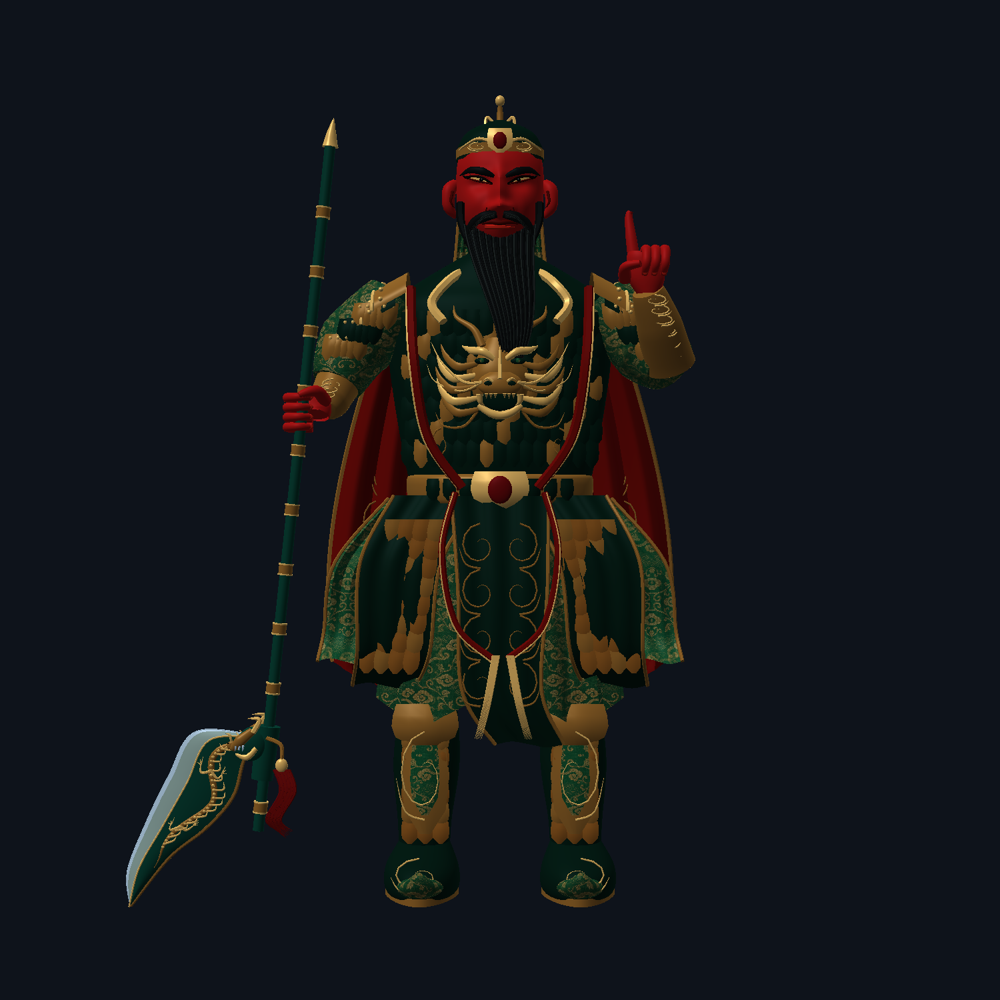
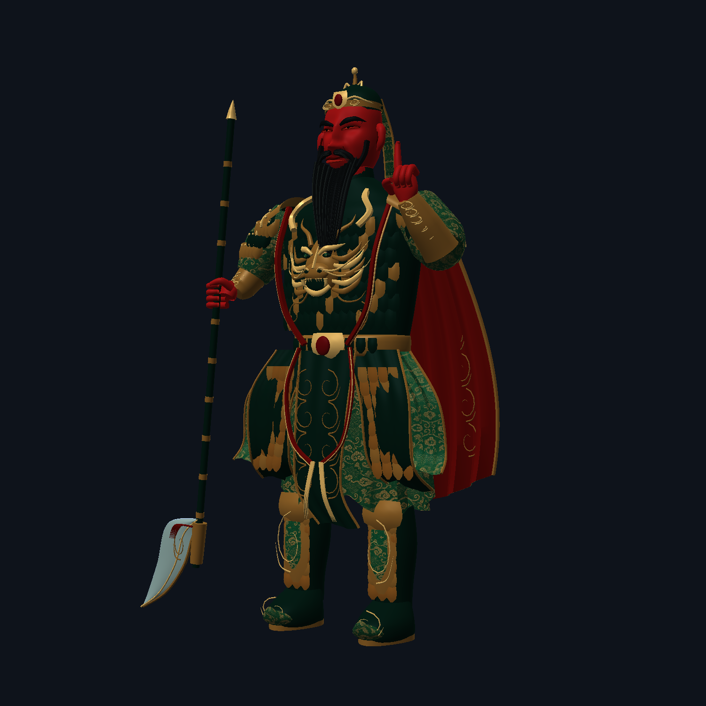
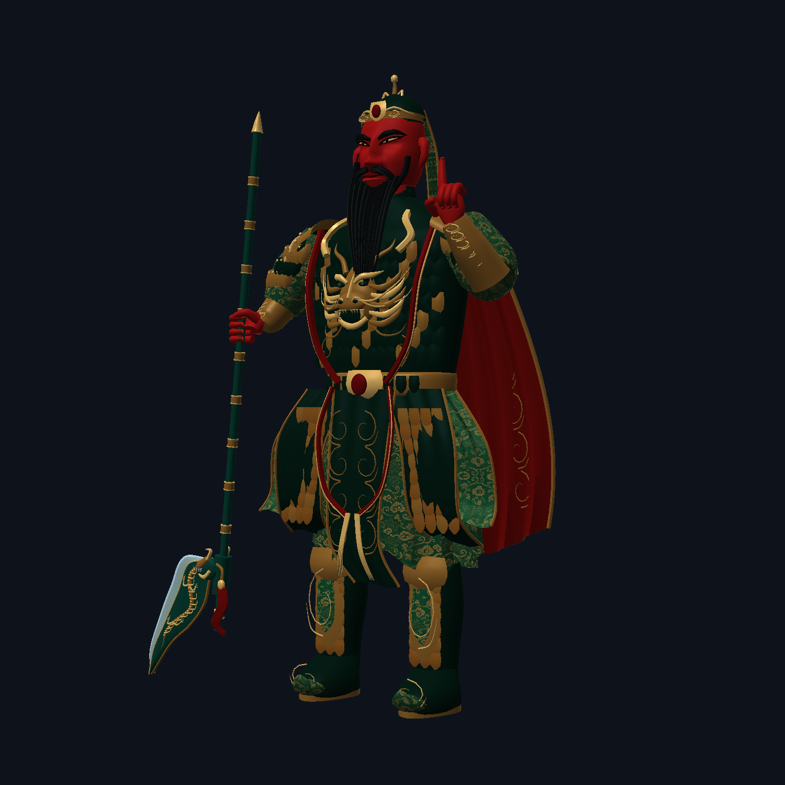

# 第二轮精修：关羽、偃月刀与青龙双阵封印

本目录图片来自**真实 Minecraft 开发客户端的生产渲染器离屏测试**，不是 AI 概念图，也不是进入存档后的世界截图。前一轮模型和图片原样保留。

## 青龙偃月刀攻击

- 上下两个同纹法阵，半径均为 2.35 格（直径 4.7 格），旧单阵半径为 1.55 格。
- 前 8 tick（约 0.4 秒）成阵；8–18 tick 由下至上出现 12 组细光柱；18–32 tick 青龙俯冲，在第 32 tick 结算原武器伤害，不额外增加伤害倍率。
- 攻击龙的模型缩放从 1.8 提高为 2.7，即线性尺寸放大 50%；龙鼻尖仍准确落在目标中心。**本轮并未换成外部高质龙模型。**
- 非玩家目标从标记到落地保持在原地，停止移动、AI 和击退；命中后恢复。重叠标记持续到最后一击，施法者离开、目标消失会取消，不写入永久 NoAI / NoGravity 标记。
- 不额外定身玩家，保留原有 PvP 伤害流程；玩家的法阵继续跟随玩家。
- 封印期间生物的普通更新暂时暂停（包括药效计时），但正常受伤冷却单独继续倒计时，因此不会额外拖慢后续攻击。定身并非全局无敌。
- 客户端与服务端都需换为本轮 JAR：网络协议升级为 6，避免旧版 20 tick 与新版 32 tick 的特效/伤害时序混用。





完整阶段关系见 [四阶段几何诊断图](after/seal-stages.png)；该图是生产线坐标的诊断投影，不是游戏截图。

## 外部高质量龙模型仍待选择

已经筛选不限模组的通用 3D 模型。细节和来源见 [外部龙资产筛选](dragon-assets.md)。最接近参考的候选为付费作品，公开模组与 GitHub 的分发许可还需明确；未购买、未下载或冒充已经接入。免费候选的外形未达到参考要求，没有勉强替换。

## 正面对比

| 上一轮 | 本轮 |
| --- | --- |
|  |  |

## 立体视角对比

| 上一轮 | 本轮 |
| --- | --- |
|  |  |

本轮实际修改：

- 丹凤眼改为细长眼裂、明确上挑的外眼角；两侧眼角抬升约 0.13980 格，保留瞳孔和小高光。
- 偃月刀重做为弯月形青玉刀身、宽银色刃口、双面金龙浮雕、立体龙口护手、独立垂落红穗和青绿金箍长柄。
- 专用 `JADE_METAL` 武器配色避免触发衣料纹理，武器没有使用金纹布料替代金龙网格。
- 握持点、刀杆轴线、刀刃朝下且在身体外侧的姿态、关羽 9 格高度均保持不变。

## 验证

- 85,814 个四边面，低于本轮 100,000 面预算；坐标、法线、边界检查全部通过。
- 整件武器与身体检查了 525,432 对候选三角形，非握持表面交叉为 0；握持轴偏移 0.000204 格，刀杆非手部净空 0.13066 格。
- 实际客户端 14 帧测试通过，包括关羽四角度、形成过程、前后透明遮挡、真正异步资源重载。关羽和两色龙重载前后的逐像素 RGB 最大差为 0，OpenGL 错误为 0。
- 随后的最终客户端测试增加两张青龙封印帧，共 **16 帧通过**：实际生产几何线宽、发光着色器、缓存巨龙与两个不同阶段均验证，见 `runtime-16-PASS.txt`。目标位置为测试坐标，仍不代表多人世界画面已验证。
- 最终 `runGameTestServer build --offline` 成功，**19 项游戏逻辑测试全部通过**，包含正常冷却下重复攻击、叠加定身、落地释放、施法者移除、伤害恰好一次与原有防御机制；见 `gametest-results.log`。
- 没有打开或修改游戏存档，客户端测试结束后自动退出。此报告不证明世界事件顺序、所有游戏场景或整合包帧率。

完整记录：`geometry-results.txt`、`runtime-PASS.txt`、`client-results.txt`。模型备份：`build/refinement-v2-before/GuanYuAvatarShape.java` 与 `GuanYuSculptor.java`。这些 build 备份会受将来的 clean 命令影响，上一轮 docs 图片不受影响。

最终源码 SHA-256：

```text
GuanYuAvatarShape.java 1706061fd4bdbc050d5c1c80914c81cc3aa6fe31050e85332dcec2d985ed5af0
HouyiAvatarShape.java ee810fa8b63a62c8ebe421134d2fd61961c550284520c6c17a9ac7c9f47dfd57
```

## 本地交付

- 源码位于桌面 `dynasty` 原仓库，没有提交或推送 GitHub。
- 更新包：`modpack/mods/dynasty-1.4.0.jar`（约 5.1 MB）。未运行 HMCL 同步、整合包导出或修改玩家存档。
- 更新包与 `build/libs/dynasty-1.4.0.jar` 的 SHA-256 相同：`e6cd314b846c7dfa411c3aa291cb354d2a17e7993251c93c6c3aee5b3ca028b2`。
- 上一版 JAR 保存在 `build/imperial-refinement-v2-backup.DkY4pu/dynasty-1.4.0.jar`，SHA-256：`51622e4fb37b971064f065ad240325fa308c67adae6fefcb4edef2ec3aae3bad`。此 build 备份同样会受未来 clean 操作影响。
- 开发客户端专用 `ImperialRuntimeQa` 不在交付 JAR 中。
