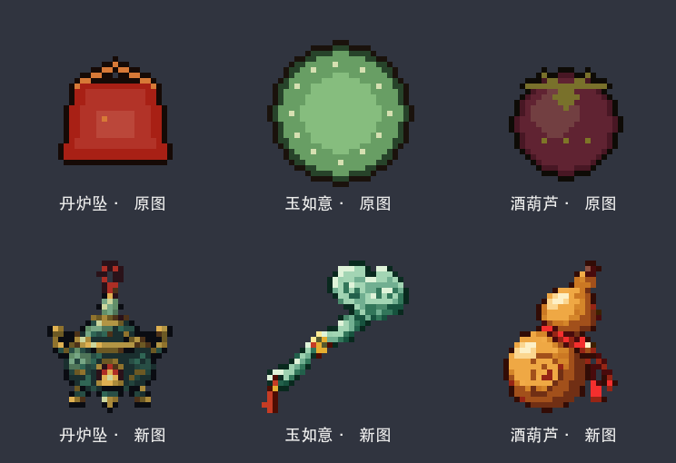

# 第一批：丹炉坠、玉如意、酒葫芦

本批只替换三个物品图标。参考桌面 mc 文件夹的游戏截图，重点是背包尺寸下能辨认物体的轮廓、结构和材质。

| 物品 | 本次独立设计 |
| --- | --- |
| 丹炉坠 | 青铜圆炉身、金色双耳、玉顶炉盖、火口、三足、红色挂绳 |
| 玉如意 | 云头、弯曲长柄、浅青玉石、金箍、红穗 |
| 酒葫芦 | 大小双肚、收腰、木塞、琥珀色外壳、红色绑绳 |

三件分别通过内置图像生成工具制作，完整提示词保存在 `prompts.json`，原稿在 `sources/`。本批首次交付为 32×32 PNG；最新资源在 `../icons-large-01/` 中升级为 64×64。当前导出脚本采用最近邻采样、最多 48 色和二值透明通道，游戏资源的路径与模型引用保持不变。

`before/` 保存本轮开始时的三张旧图。恢复其中一件时，将对应旧图复制回资源目录即可。重新导出本批成品：在项目根目录运行 `sh tools/art/export_readable_batch_01.sh`，需要 ImageMagick。

本次只检查了实际 PNG、尺寸、透明通道、模型引用、构建和 JAR 内资源。没有启动游戏进行实机视觉验收。其余 521 张贴图不在这一批的重绘范围内。
