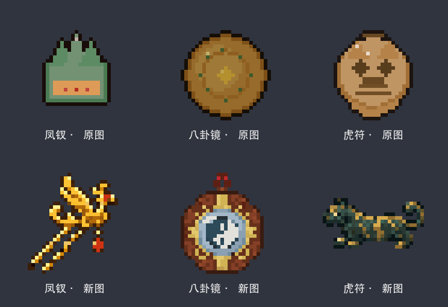

# 第二批：凤钗、八卦镜、虎符

本批单独设计三件物品，保留第一批的丹炉坠、玉如意、酒葫芦。

| 物品 | 识别特征 |
| --- | --- |
| 凤钗 | 金色凤鸟、上扬羽翼、两根分开的钗脚、红色坠珠 |
| 八卦镜 | 八角木框、金色卦纹、蓝银镜面、中央阴阳图 |
| 虎符 | 侧面青铜虎形、短足、卷尾、金色虎纹、中部合缝 |

三件分别使用内置 image_gen 生成，凤钗另做一次小尺寸可读性修订：缩短钗脚并扩大间距。完整提示词位于 `prompts.json` 和 `revision.json`，最终生成原稿位于 `sources/`，本轮开始时的旧图位于 `before/`。

实际游戏贴图为 32×32 RGBA PNG，最近邻采样，无抖色，最多 20 色，二值透明边缘。导出命令：`sh tools/art/export_readable_batch_02.sh`（需要 ImageMagick）。脚本只处理本批三个明确列出的文件。恢复任一旧图时，复制 `before/` 对应文件至 `src/main/resources/assets/dynasty/textures/item/`。

检查范围：小尺寸图像目视检查、PNG 尺寸/透明通道、模型引用、资源变化范围、Forge 构建、构建 JAR 与整合包 JAR 内资源一致性。本轮没有启动游戏进行实机验收。

两批累计重做 6 张；其余贴图继续分批处理。
